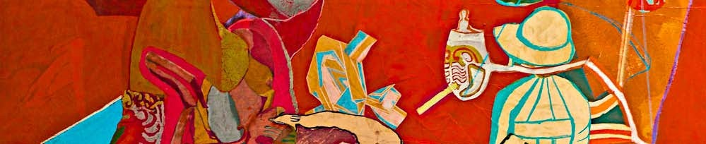
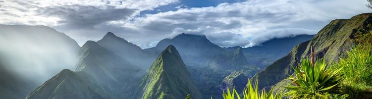

---
header:
  caption: ""
  image: "conference_stock.jpg"
title: Conferences
view: 2
---

The SAMO (Sensitivity Analysis of Model Output) conferences are cross-disciplinary conferences, held every three years, related to the fields of sensitivity analysis, design of experiments, model calibration and validation issues, structural reliability, uncertainty quantification, and related application areas (engineering, environment, agronomy, finance, etc.).

This page gives a full list of past and upcoming SAMO conferences, with links to any resources that are still available.

## 2025 Grenoble

* :pushpin: **Location**: Grenoble, France
* :house: **Host Institution**: Université Grenoble Alpes
* :date: **Date**: April 23-25, 2025
* :link: **Links**: [Website](https://samo2025.sciencesconf.org/) | [Proceedings](PROCCEDINGS_SAMO_2025_Grenoble.pdf)

List of plenaries:
* Tim Bedford (University of Strathclyde, Glasgow)
* Sergei Kucherenko (Imperial College London)
* Frances Kuo (University of New South Wales, Sydney)
* Francesca Pianosi (University of Bristol)
* Arnald Puy (University of Birmingham)

# Past conferences

## 2022 Florida

* :pushpin: **Location**: Tallahassee, Florida, USA
* :house: **Host Institution**: Florida State University
* :date: **Date**: Mar 14-16, 2022
* :link: **Links**: [Website](https://samo2022.math.fsu.edu/)

## 2019 Barcelona

* :pushpin: **Location**: Barcelona, Spain
* :house: **Host Institution**: Universitat Oberta de Catalunya
* :date: **Date**: Oct 28-30, 2019
* :link: **Links**: [Website](https://symposium.uoc.edu/23220/detail/ninth-international-conference-on-sensitivity-analysis-of-model-output.html) | [Proceedings](Proceedings_SAMO_2019.pdf)

## 2016 La Réunion

* :pushpin: **Location**: Le Tampon, La Réunion, France
* :house: **Host Institution**: University of Reunion Island
* :date: **Date**: Nov 30 - Dec 3, 2016
* :link: **Links**: [Website](https://samo2016.univ-reunion.fr/) | [Proceedings](http://www.andreasaltelli.eu/file/repository/Proceedings_SAMO_2016.pdf)

## 2013 Nice

* :pushpin: **Location**: Nice, France
* :house: **Host Institution**: University of Nice
* :date: **Date**: Jul 1-4, 2013
* :link: **Links**: [Website](https://www.gdr-mascotnum.fr/2013) | [Proceedings](http://www.andreasaltelli.eu/file/repository/oral_proceedings.pdf) | [Poster proceedings](http://www.andreasaltelli.eu/file/repository/poster_proceedings.pdf) | [PhD proceedings](http://www.andreasaltelli.eu/file/repository/phd_proceedings.pdf)

## 2010 Milan

* :pushpin: **Location**: Milan, Italy
* :house: **Host Institution**: Università Bocconi
* :date: **Date**: Jul 19-22, 2010
* :link: **Links**: [Website](https://www.unibocconi.it/wps/wcm/connect/1792da004cadb82c93daff0f7bdc7be0/Programma_samo.pdf1?MOD=AJPERES) | [Proceedings](https://1drv.ms/u/s!ArKkbDuzxdxCjrxGzcxlv3PJ2AEK_g?e=DkV7uR)

## 2007 Budapest

* :pushpin: **Location**: Budapest, Hungary
* :house: **Host Institution**: Eötvös University (ELTE)
* :date: **Date**: Jun 18-22, 2007
* :link: **Links**: [Website](http://samo2007.chem.elte.hu/) | [Proceedings](http://www.andreasaltelli.eu/file/repository/PROCEEDINGS_SAMO_2007_Budapest.pdf)

## 2004 Santa Fe

* :pushpin: **Location**: Santa Fe, New Mexico, USA
* :house: **Host Institution**: Los Alamos National Laboratory
* :date: **Date**: Mar 8-11, 2004
* :link: **Links**: [Proceedings](http://www.andreasaltelli.eu/file/repository/PROCCEDINGS_SAMO_SantaFe.pdf)

## 2001 Madrid

* :pushpin: **Location**: Madrid, Spain
* :house: **Host Institution**:
* :date: **Date**: Jun 18-20, 2001
* :link: **Links**: [Proceedings](http://www.andreasaltelli.eu/file/repository/PROCEEDINGS_SAMO_2001_Madrid.pdf)

## 1998 Venice

* :pushpin: **Location**: Venice Ca' Dolfin, Italy
* :house: **Host Institution**: University of Venice
* :date: **Date**: Jun 18-20, 2001
* :link: **Links**: [Proceedings](http://www.andreasaltelli.eu/file/repository/PROCEEDINGS_SAMO_1998_Venice.pdf)

## 1995 Belgirate

* :pushpin: **Location**: Belgirate Villa Carlotta, Italy
* :house: **Host Institution**: European Commision, Joint Research Centre
* :date: **Date**: Sep 25-27, 2001
* :link: **Links**: [Proceedings](http://www.andreasaltelli.eu/file/repository/PROCEEDINGS_SAMO_95_Belgirate.pdf)
